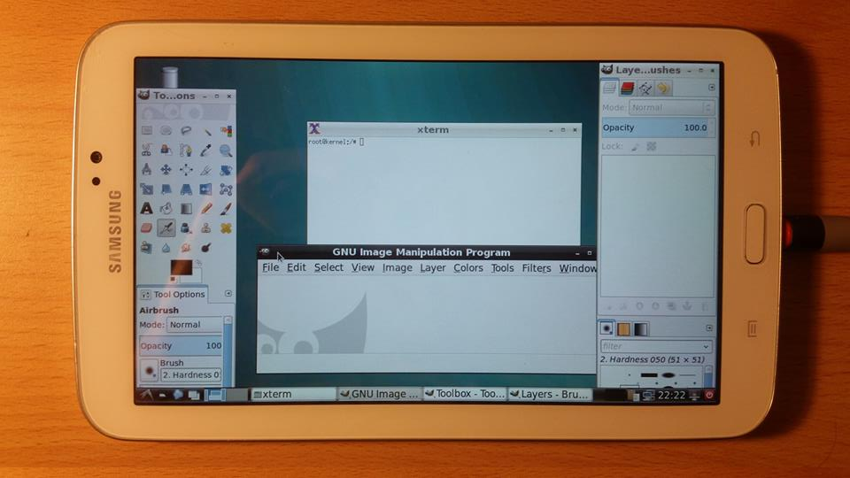

# build_debian_arm




This is a simple script to help you to build a debian for your android smartphone/tablet 

I hope it will help people to understant how debian work on arm 

This script will build the debian jessie distribution which will will run on top of the android kernel. 
This script doesn't recompile the kernel (for now :) )

Clone this git 

The first script need to be run on your computer and will build a tar.bz2 file 

``` shell
./first-script.sh
```


You should end up with this file structure

```
README.md
debian.jpg
first-script.sh
second-script.sh
output/
+--debian_armhf_jessie.tar.bz2

```

You will have to copy the tar.bz2 file and the second-script.sh to your android device inside the same folder 

For exemple in /data/tmp/debian or in sdcard folder 

Then make sure that the partiction you have copied the files on your android device is mounted read write. You will need to have a rooted android phone

Then run the second script on your android device in the same folder that the tar.bz2 file

You will end-up in a fully working chroot debian jessie environment on your android device 

## First Script

```shell
#!/bin/sh

#### Build debian arm ####

GREEN='\033[0;32m'
RED='\033[0;31m'
NC='\033[0m' # No Color

DIR=$(pwd)/debian_armhf_jessie
OUT=$(pwd)/output
FILE=$OUT/debian_armhf_jessie.tar.bz2

echo "
${GREEN}
###############################################################################

Building debian for armhf processor

###############################################################################
${NC}
"

if [ -d $FILE ]; then
    echo "removing old file"
    rm -rf $FILE
fi


mkdir $DIR


echo "
${GREEN}
##############################################################################################

Beginning of deboostrap

##############################################################################################
${NC}
"

debootstrap --arch=armhf --foreign  jessie  $DIR  http://httpredir.debian.org/debian

echo "
${GREEN}
##############################################################################################

Adding qemu binnary for deboostrap second stage

##############################################################################################
${NC}
"


cp /usr/bin/qemu-arm-static $DIR/usr/bin

echo "
${GREEN}
##############################################################################################

Starting deboostrap second stage

##############################################################################################
${NC}
"

chroot $DIR /debootstrap/debootstrap --second-stage

echo "
${GREEN}
##############################################################################################

Creating tar.bz2 achive

##############################################################################################
${NC}
"
mkdir $OUT

tar jcvf $FILE $DIR

echo "
${GREEN}
##############################################################################################

Delete tmp file

##############################################################################################
${NC}
"

rm -rf $DIR

echo "
${GREEN}
##############################################################################################

DONE !!

##############################################################################################
${NC}
"
```
